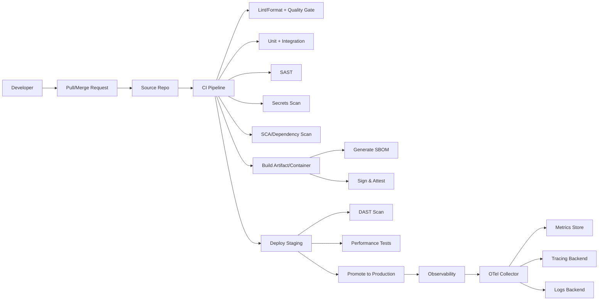

# خصائص مشروع Clean Code عالي الأداء وعالي الأمان

## ملخص تنفيذي

هذا التقرير يحدد **خصائص قابلة للتنفيذ والقياس** تجعل أي مشروع برمجي “Clean Code project” مع وضع **الأداء (Performance)** و**الأمان (Security)** في أعلى الأولويات، دون افتراض لغة أو منصة بعينها (غير محددة). يرتكز الإطار على ثلاثة محاور مرجعية: مبادئ “Clean Code” والاختيار الواعي للبنية، دمج الأمن ضمن دورة حياة التطوير وفق أطر معيارية مثل **SSDF**، والتحويل من “ادّعاء الجودة” إلى “جودة مُقاسة” عبر مؤشرات وأهداف تشغيلية (SLOs) ومراقبة قابلة للتدقيق. citeturn1search4turn1search1turn1search33turn9view1turn3search24

أهم الاستنتاجات العملية:

- **لا يوجد مشروع Clean Code بدون نظام حوكمة تقني**: بنية واضحة، حدود طبقات، قرارات معمارية موثّقة (ADRs)، ومعايير تسمية/تنميط موحّدة عبر الفريق. citeturn12search11turn1search3turn15search2
- **الأداء والأمان لا يُضبطان في النهاية**: يجب تعريفهما كمتطلبات غير وظيفية مبكرة، وترجمتها إلى اختبارات آلية (Performance + Security testing) و”بوابات” CI/CD تمنع دمج/إصدار تغييرات تُخالف الحدود المتفق عليها. citeturn9view1turn4search0turn4search11turn5search0turn5search1
- **استخدم وثائق ومعايير أمن تطبيقات راسخة بدل قوائم عشوائية**: كحد أدنى “OWASP Top 10” للتوعية وترتيب المخاطر، ومعيار متطلبات تحقق مثل “OWASP ASVS” لبناء قائمة متطلبات واختبارات تحقق. citeturn10search0turn9view2turn10search13
- **أمّن سلسلة التوريد البرمجية**: SBOM (CycloneDX أو SPDX) + فحص تبعيات + توقيع/تحقق من المخرجات + نموذج نضج مثل SLSA للانتقال بخطوات مدروسة. citeturn2search15turn8search1turn9view0turn7search12
- **المرئية التشغيلية (Observability) شرط للأداء**: تبنّي OpenTelemetry لجمع الإشارات (traces/metrics/logs) وربطها بمخزن مقاييس مثل Prometheus وأدوات تتبع مثل Jaeger يختصر زمن التشخيص ويحسن الانضباط في تحسين الأداء. citeturn3search18turn3search19turn17search0

## افتراضات ونطاق ومعايير نجاح قابلة للقياس

**افتراضات غير محددة (حسب طلبك):**

- لغة البرمجة/الإطار (غير محددة) – ستُذكر أمثلة عامة مع JavaScript/TypeScript وPython وJava كأكثر اللغات شيوعاً عند الحاجة.
- نوع النظام (خدمة API، تطبيق ويب، موبايل، نظام دفعات… إلخ) (غير محدد).
- بيئة النشر (سحابة/محلي/هجينة) (غير محددة).
- المتطلبات التنظيمية (PCI, HIPAA, GDPR…) (غير محددة).  
  بسبب ذلك، ستظهر “المقاييس المستهدفة” كقيم إرشادية قابلة للضبط حسب المجال والحمل والميزانية.

**تعريف عملي لمشروع Clean Code عالي الأداء وعالي الأمان**  
مشروع “Clean Code” ليس “تنسيق كود” فقط؛ بل منظومة تقلل التعقيد وتزيد قابلية الصيانة عبر مبادئ التصميم والقراءة، وتربط ذلك باختبارات وبوابات آلية تمنع تدهور الجودة بمرور الوقت. هذا يتوافق مع أدبيات Clean Code وDRY وSOLID بوصفها أدوات لتقليل التعقيد والاعتمادية الهشة. citeturn1search4turn1search33turn1search1

**معايير نجاح مقترحة وقابلة للقياس (تُعتمد كأهداف SLO/Quality Gates):**

- **موثوقية الخدمة**: صياغة SLOs لكل مسار حرج، وربطها بسياسة “Error Budget”. قاعدة عملية شائعة: **Error Budget = 100% - SLO%** (مثال: 99.9% ⇒ 0.1% ميزانية خطأ) مع سياسة واضحة عند استهلاك الميزانية. citeturn3search16turn3search4turn3search20
- **زمن الاستجابة**: اعتماد Percentiles (P95/P99) بدل المتوسط عند تحديد أهداف زمن الاستجابة (لأن المتوسط يخفي الذيلات). citeturn3search24turn3search4
- **الأمان**: “لا ثغرات حرجة معروفة في التبعيات قبل الإصدار”، “لا أسرار في المستودع”، “متطلبات تحقق أمنية موثّقة ومغطاة باختبارات/فحوص” (مثلاً عبر ASVS). citeturn5search3turn2search2turn9view2
- **سلسلة التوريد**: SBOM لكل بناء + توقيع Artifact + قابلية تتبع المصدر/البناء وفق إطار SLSA. citeturn2search15turn9view0turn7search12

## خصائص بنية المشروع وجودة الكود

**أولاً: بنية المشروع (Architecture)**

1. **حدود واضحة بين الطبقات والمجالات**  
   اجعل الاعتمادات تتجه “للداخل” (نحو منطق المجال) قدر الإمكان عبر واجهات/Ports وAdapters، لتقليل الترابط وتمكين الاختبار والاستبدال. (هذا يترجم عملياً إلى: فصل Domain/Application/Infrastructure أو تقسيمات مشابهة بحسب طبيعة النظام).  
   أداة داعمة: توثيق القرار عبر ADR “قرار واحد مهم = وثيقة واحدة” كي لا تتحول البنية إلى “معرفة شفوية”. citeturn12search11turn12search3

2. **تنظيم يتجنب “مشروع كومة ملفات”**  
   اعتمد هيكلة مجلدات تعكس الحدود (Bounded contexts أو Modules) بدل “حسب التقنية فقط” (controllers/services/utils… بشكل مسطح). هذا يزيد قابلية الفهم ويمنع التضخم غير المنضبط.

3. **إدارة الإعدادات كتهيئة خارجية لا ككود**  
   فصل الإعدادات (Config) عن الكود (بيئات، أسرار، منافذ، endpoints) ومنع “hardcoding”. من أفضل الممارسات المشهورة أن يكون التطبيق قابل النقل عبر بيئات متعددة مع اختلاف الإعدادات عبر البيئة. citeturn1search3turn2search2

4. **توثيق واجهات API بعقد واضح (إن وُجد API)**  
   استخدم توصيفاً معيارياً لواجهات HTTP APIs لتوحيد الفهم وتوليد توثيق/اختبارات/عملاء تلقائياً (مثل OpenAPI). citeturn12search0turn12search4

5. **تصميم أخطاء (Error Model) وحزم استثناءات ثابتة**  
   ثبات شكل الأخطاء يسهل الاختبار والمراقبة ويقلل “التعامل الخاص” في كل مكان. (مثال: تعريف Error codes، وربطها بسجل أمني/تشغيلي).

**أدوات مقترحة لبعد “البنية” (2–3):**

- ADRs (ممارسة توثيق) عبر قوالب/مستودع ADR. citeturn12search3turn12search11
- OpenAPI لوصف API (عند وجود HTTP APIs). citeturn12search0turn12search12

**ثانياً: جودة الكود (Readability, Naming, Modularity, SOLID, DRY)**

1. **أسلوب تسمية صارم ومتسق**  
   التسمية هي “واجهة” الكود. ضع قواعد: أسماء تعكس النية، أسماء وظائف فيها فعل/نتيجة، وأسماء كيانات المجال تطابق لغة العمل (Ubiquitous language).

2. **قابلية القراءة أولاً**  
   اتبع فلسفة Clean Code: دوال صغيرة، تعقيد أقل، تجنب آثار جانبية غير متوقعة، وعقود واضحة للدوال/الواجهات. citeturn1search4

3. **التماسك (Cohesion) أعلى، والاقتران (Coupling) أقل**  
   هذا هدف SOLID عملياً، ويسهل الاختبارات والتغيير. مرجع SOLID المرتبط بأعمال Robert C. Martin يساعد في بناء وحدات قابلة للتعديل دون كسر واسع. citeturn1search1

4. **DRY كمبدأ “عدم تكرار المعرفة” لا مجرد تكرار الأسطر**  
   DRY حسب تعريفه الأصلي: تمثيل وحيد للمعرفة داخل النظام، لتقليل التعديلات المتعددة عند تغيير قاعدة واحدة. citeturn1search33

5. **قواعد تنسيق ولينت موحّدة ومفروضة آلياً**  
   بدون فرض آلي، تتحول القواعد إلى “اقتراحات”. اعتمد طبقة محايدة للغة ثم أدوات خاصة باللغة.

**أدوات مقترحة لبعد “جودة الكود” (محايدة للغة + أمثلة حسب لغة شائعة):**

- محايدة للغة: EditorConfig لتوحيد قواعد التنسيق عبر المحررات وضمن التحكم بالإصدارات. citeturn15search2turn15search5
- تحليل جودة/أمن كود عام: SonarQube (Quality gate على التحليل الساكن). citeturn15search37turn5search6
- أمثلة حسب لغة (اختر 2–3 فقط حسب مشروعك):
  - JS/TS: ESLint + Prettier. citeturn14search5turn14search2
  - Python: Ruff (lint + formatter) أو Black كخيار formatter مستقل. citeturn14search0turn14search4turn14search3
  - Java: Checkstyle لتطبيق Coding Standard + SpotBugs لاكتشاف أنماط أخطاء. citeturn15search0turn15search4

**مثال تكوين موجز (EditorConfig)**

```ini
# .editorconfig
root = true

[*]
charset = utf-8
end_of_line = lf
insert_final_newline = true
trim_trailing_whitespace = true
indent_style = space
indent_size = 2
```

## خصائص الاختبارات

الهدف ليس “وجود اختبارات”، بل **مصفوفة اختبارات تغطي المخاطر والأهداف** (جودة + أداء + أمن) مع دمجها في CI/CD.

1. **Unit Tests مع عزل واضح وحد أدنى تغطية واقعي**

- قواعد: اختبارات سريعة، محددة، لا تعتمد على الشبكة/الملفات/الوقت الحقيقي قدر الإمكان.
- أدوات حسب لغة شائعة (2–3):
  - pytest (Python). citeturn13search1
  - JUnit (Java). citeturn13search5
  - (JS/TS لم يُبحث هنا بالتفصيل، لكن عادة Jest/مشابه).

2. **Integration Tests باستخدام Dependencies حقيقية بشكل “Throwaway”**  
   بدلاً من محاكاة مفرطة، شغّل قواعد البيانات/الرسائل/الخدمات الداعمة في حاويات مؤقتة أثناء الاختبار لضمان “صحة التكامل”.

- أداة قوية متعددة اللغات: Testcontainers. citeturn13search9turn13search33

3. **E2E Tests لمسارات المستخدم/التكامل النهائي**  
   اختبارات E2E تعطيك ثقة في المسارات الحرجة، لكن يجب أن تكون محدودة وموجهة (حتى لا تصبح بطيئة وهشة).

- أداة موصى بها متعددة اللغات: Playwright (يدعم TS/JS/Python/Java). citeturn13search0turn13search3

4. **Performance Tests كاختبارات بوابة (Gating) لا كتمرين موسمي**  
   اختبر السيناريوهات: smoke/average/stress/soak/spike مع thresholds واضحة.

- أدوات (2–3):
  - k6 (اختبارات حمل/أداء ككود). citeturn4search0turn4search6
  - Apache JMeter (واسع الاستخدام، GUI + CLI). citeturn4search1turn4search4

5. **Security Tests تشمل: اختبارات متطلبات + فحوص ديناميكية (DAST)**

- مرجعية منهجية للاختبار الأمني: WSTG (إطار وممارسات اختبار أمني لتطبيقات الويب/الخدمات) مع الإشارة أن إصدار 5 قيد التطوير وأن v4.2 متاح. citeturn2search25turn2search13
- DAST آلي ضد بيئة Staging: استخدم OWASP ZAP. citeturn4search11turn4search26
- اختبارات Authorization الممنهجة (مصفوفة صلاحيات): استعن بإرشادات OWASP الخاصة بأتمتة اختبارات التفويض لتجنب ثغرات Broken Access Control. citeturn11search14turn10search0

**مقاييس مستهدفة مقترحة للاختبارات (إرشادية):**

- Unit: زمن تشغيل على CI أقل من 5–10 دقائق لمعظم المشاريع المتوسطة.
- Integration: زمن محدد/موازي، مع “Flake rate” منخفض جداً (هدف <1% إعادة تشغيل بسبب هشاشة).
- Performance: المرور/الفشل عبر thresholds (مثلاً: P95 latency < هدف محدد، error rate < هدف محدد) متوافق مع SLO. citeturn3search24turn4search0
- Security: لا تمرير لأي ثغرة “Critical” من التبعيات، وعدم وجود أسرار بالريبو. citeturn5search3turn6search3

## أدوات وعمليات CI/CD وإدارة التبعيات والإصدارات

**أولاً: CI/CD كقلب نظام الجودة**

- GitHub Actions: منصة CI/CD بملفات YAML. citeturn8search10turn8search2
- GitLab CI/CD: Pipelines تُعرّف في `.gitlab-ci.yml`. citeturn8search3turn8search7

**بوابات قياسية في الـ Pipeline (تسلسل نموذجي):**

1. Lint/Format + Quality Gate.
2. Unit + Integration.
3. SAST + Secrets scan. citeturn5search0turn6search3
4. SCA/Dependency vulnerabilities + (اختياري) Policy checks. citeturn5search3turn11search1
5. Build artifact/container + Scan image/IaC. citeturn6search2turn7search3
6. SBOM generation + publishing. citeturn2search15turn8search1
7. Sign artifact + attestation/provenance. citeturn7search12turn9view0
8. Deploy to staging + DAST. citeturn4search11
9. Deploy production مع مراقبة وRollback آلي.

**مخطط يوضح علاقة المكونات (Mermaid)**



**ثانياً: إدارة التبعيات (Dependencies)**

1. **فحص ثغرات التبعيات (SCA)**

- OWASP Dependency-Check كأداة مبكرة لـ SCA لفحص المكوّنات المعروفة بثغرات. citeturn5search3turn5search16

2. **تحليل مستمر قائم على SBOM**

- OWASP Dependency-Track منصة تحليل مكونات تعتمد SBOM لتقليل مخاطر سلسلة التوريد ومتابعة المخاطر عبر الإصدارات. citeturn11search1turn11search9

3. **تحديث تبعيات آلي**

- Dependabot: Pull Requests آلية لتحديث تبعيات بها ثغرات، وأيضاً تحديثات إصدارات عامة. citeturn6search0turn6search20
- Renovate: تحديث تبعيات وLockfiles عبر PRs وقابلية جدولة وتقليل الضجيج. citeturn6search1turn6search9

**ثالثاً: الإصدارات (Releases)**

- **Semantic Versioning** كقاعدة لترميز معنى التغييرات في رقم الإصدار. citeturn8search0
- **Keep a Changelog** لتوثيق تغييرات مفهومة للبشر بين الإصدارات. citeturn12search2

**مثال أوامر موجزة (أفكار قابلة للإدراج في CI):**

```bash
# فحص تبعيات
dependency-check --scan . --format JSON --out build/reports

# توليد SBOM (مثال عام؛ الأداة تختلف حسب النظام)
# ثم رفعه لـ Dependency-Track

# فحص أسرار
gitleaks detect --source . --redact

# فحص صورة حاوية
trivy image --severity CRITICAL,HIGH --exit-code 1 myapp:sha-<digest>

# توقيع artefact
cosign sign <image-uri-or-digest>
```

## مراقبة وقياس الأداء مع مقاييس مستهدفة

**أولاً: Observability كمتطلب تصميم**  
اعتمد الإشارات الثلاث: **Metrics + Traces + Logs** وربطها مع سياق (Resource/Trace IDs) لتقليل MTTR. citeturn3search18turn3search6turn3search14

**أدوات مقترحة (2–3) لبعد المراقبة/APM:**

- OpenTelemetry: إطار محايد للمزود لجمع وتصدير بيانات المرئية (traces/metrics/logs). citeturn3search18turn3search2turn3search6
- Prometheus: تخزين/جمع مقاييس كنماذج time series مع labels. citeturn3search19turn3search0
- Jaeger: منصة تتبع موزع، موصى بأدوات OpenTelemetry للتجهيز. citeturn17search0turn17search9

**ثانياً: Profiling وBenchmarking كجزء من الدليل لا الحدس**

- في Go: pprof يوفّر endpoints وملفات CPU/heap profiles بصيغ pprof. citeturn17search2turn17search24
- في Java: Java Flight Recorder يجمع بيانات profiling وتشخيص بأثر منخفض ويُستخدم للتحليل. citeturn17search14

(هذه أمثلة؛ اختر أدوات profiling حسب اللغة/المنصة—غير محددة).

**ثالثاً: مقاييس مستهدفة عملية (إرشادية)**

- **SLIs**:
  - Latency: P95/P99 لكل endpoint/عملية حرجة.
  - Availability/Success rate: نسبة الطلبات الناجحة (2xx/3xx أو مفهوم نجاح خاص بالمجال).
  - Error rate: نسبة 5xx/Exceptions.
- **SLOs**: تحديد هدف لكل SLI مع فترة قياس، ثم اشتقاق Error Budget وسياسة عند نفاد الميزانية. citeturn3search24turn3search4turn3search16
- **مقاييس تشغيل Prometheus**: الانتباه لقابلية الانفجار في عدد السلاسل الزمنية بسبب كثرة labels/الكاردينالية (خاصة في Kubernetes). citeturn3search0turn3search31

## ممارسات الأمان والبنية التحتية

**مرجعية أمنية “على مستوى التطبيق” (Application Security)**

1. **اعتماد OWASP Top 10 كخط أساس للتوعية وترتيب المخاطر**  
   القائمة في إصدار 2021 تتضمن فئات مثل Broken Access Control وCryptographic Failures وInjection… إلخ. citeturn10search0

2. **تحويل الأمن إلى متطلبات تحقق عبر OWASP ASVS**  
   ASVS 5.0.0 (مذكور أنه إصدار مستقر بتاريخ مايو 2025) يوفر قائمة متطلبات واختبارات تحقق يمكن تحويلها إلى backlog وقوالب تعريف جاهزية (Definition of Done). citeturn10search13turn9view2turn10search1

3. **Secure SDLC وفق NIST SSDF**  
   SSDF يُقدّم ممارسات أمنية عالية المستوى قابلة للدمج بأي SDLC، مع هدف تقليل الثغرات وآثارها. يوجد أيضاً مسودة Rev.1 (Initial Public Draft) منشورة في 17 ديسمبر 2025. citeturn9view1turn0search3

4. **نماذج نضج**

- OWASP SAMM: إطار مفتوح يساعد في بناء استراتيجية أمن برمجيات وقياس النضج. citeturn2search4turn2search16
- OWASP DSOMM: إطار يساعد على ترتيب أنشطة DevSecOps ودمج الأمن في خطوط الأنابيب. citeturn11search0turn11search4

**أدوات فحوص أمنية (SAST/DAST/SCA/Secret scanning)**

- SAST: Semgrep (SAST + أسرار + تبعيات “reachable”) وCodeQL لفحص ثغرات الكود. citeturn5search0turn5search1
- DAST: OWASP ZAP. citeturn4search11turn4search26
- SCA: OWASP Dependency-Check + منصة Dependency-Track SBOM analysis. citeturn5search3turn11search1
- Secrets: OWASP Secrets Management guidance + أدوات كشف (مثل Gitleaks) لمنع تسريب أسرار للمستودع. citeturn2search2turn6search3

**مصادقة/تفويض/تشفير**

- Authentication/Authorization: اعتمد إرشادات OWASP لتقليل فشل المصادقة وكسر التفويض، مع اختبارات تفويض آلية مبنية على مصفوفة صلاحيات. citeturn2search6turn11search2turn11search14
- Password Storage: اتبع إرشادات OWASP لتخزين كلمات المرور بأمان. citeturn10search2turn10search6
- Cryptographic Storage & Key Management: إرشادات OWASP لتشفير البيانات المخزنة وإدارة المفاتيح ودورة حياتها. citeturn10search10turn2search30
- إرشادات هوية رقمية: NIST SP 800-63-3 تم الإبلاغ أنه استُبدل بـ 800-63-4 اعتباراً من 1 أغسطس 2025 (يهم عند تصميم المصادقة). citeturn4search2

**البنية التحتية (Containerization/Orchestration/Network hardening)**

1. **Container Hardening**

- Docker: إعادة بناء الصور بانتظام لجلب تحديثات الأمن، والاهتمام بممارسات الأمان الرسمية. citeturn7search3turn7search11
- OWASP Docker Security Cheat Sheet: قائمة أخطاء شائعة وممارسات جيدة لتأمين الحاويات. citeturn11search3

2. **Orchestration Hardening في Kubernetes (إن وُجد)**

- Pod Security Standards: ثلاث سياسات (Privileged/Baseline/Restricted) لتحديد مستوى الأمن المطلوب. citeturn7search2
- RBAC: آلية تنظيم وصول الموارد حسب الأدوار؛ مع ممارسات جيدة لتقليل التصعيد. citeturn16search1turn16search5
- Network Policies: تقييد الاتصالات بين الـ Pods حسب قواعد واضحة. citeturn7search6
- تشفير بيانات حساسة في etcd: Kubernetes يقدم مهمة لتشفير بيانات الموارد (مثل Secrets) أثناء التخزين. citeturn16search2

3. **Network hardening وmTLS (عند وجود Service Mesh)**

- Istio يقدم خطوات لترحيل/فرض mutual TLS داخل الـ mesh. citeturn16search3turn16search16

4. **Secrets Management**

- OWASP: أفضل الممارسات لإدارة الأسرار (تخزين/تدوير/تدقيق). citeturn2search2
- Vault: يركز على مركزية إدارة الأسرار والتدوير والتدقيق. citeturn7search5turn7search21

5. **Supply Chain Security: SBOM + Signing + نموذج نضج**

- CycloneDX (OWASP): معيار SBOM وشفافية سلسلة التوريد. citeturn2search15turn2search3
- SPDX: معيار SBOM (ISO/IEC 5962:2021 مذكور في موقع المشروع). citeturn8search1turn8search13
- Cosign (Sigstore): توقيع artefacts (صور/OCI) بأوامر مثل `cosign sign`. citeturn7search12turn7search0
- SLSA: إطار لتقليل العبث وتحسين سلامة المخرجات عبر مستويات ضمان. citeturn9view0

## التوثيق وحوكمة المساهمة مع جدول مقارنة الأدوات وأولويات التنفيذ

**أولاً: التوثيق وتعليمات المساهمة (Contribution)**

1. **README “تشغيلي”**  
   يحتوي: هدف النظام، كيف تُشغل محلياً، كيف تُشغل الاختبارات، كيف تُطبق linters، كيف تُدار الأسرار محلياً، وما هي بوابات الـ CI.

2. **CONTRIBUTING.md واضح**  
   يوضح: معايير PR، سياسة الفروع، تعريف الجاهزية (DoD)، حد أدنى للاختبارات/التغطية، ومتطلبات الأمن (عدم أسرار، اجتياز SAST/SCA).

3. **Code of Conduct**  
   استخدام قالب معروف مثل Contributor Covenant لتحديد سلوك المساهمة والتعامل. citeturn12search1turn12search5

4. **Changelog مُدار للبشر**  
   اعتماد Keep a Changelog لتسهيل تتبع ما تغير فعلاً لكل إصدار. citeturn12search2turn8search0

5. **سجل قرارات معمارية ADR**  
   لمنع “النسيان المؤسسي” وشرح لماذا اتخذت قرارات تصميمية معينة. citeturn12search11turn12search3

**ثانياً: جدول مقارنة الأدوات المقترحة (مزايا/عيوب مختصرة)**  
(تم اختيار أدوات “عابرة للغات” قدر الإمكان لتجنب افتراض منصة.)

| الفئة                  | الأداة                                                                      | مزايا عملية                                                                                     | عيوب/ملاحظات                                                                    | متى تفضّلها                                                  |
| ---------------------- | --------------------------------------------------------------------------- | ----------------------------------------------------------------------------------------------- | ------------------------------------------------------------------------------- | ------------------------------------------------------------ |
| CI/CD                  | entity["organization","GitHub Actions","ci/cd service"]                  | YAML داخل المستودع، تشغيل بناء/اختبار/نشر. citeturn8search10turn8search2                    | الاندماج الأمثل عند استضافة الكود على GitHub.                                   | مشاريع مستضافة على GitHub وتحتاج CI قريب من الكود.           |
| CI/CD                  | entity["organization","GitLab CI/CD","ci/cd platform"]                   | Pipelines عبر `.gitlab-ci.yml`، بنية مراحل/وظائف واضحة. citeturn8search3turn8search7        | يعتمد على تبنّي GitLab كمنصة أو تكامل معها.                                     | فرق تستخدم GitLab أو تحتاج قدرات مدمجة بالمنصة.              |
| SAST                   | entity["organization","Semgrep","sast tool"]                             | تحليل ساكن سريع + تكامل CI + دعم أسرار/تبعيات بحسب الوثائق. citeturn5search0turn5search27   | ضبط القواعد/الضجيج يحتاج حوكمة (triage).                                        | “Shift-left” سريع على PRs مع قابلية تخصيص.                   |
| SAST                   | entity["organization","CodeQL","code scanning engine"]                   | يحدد ثغرات وأخطاء ويعرضها كتنبيهات فحص كود. citeturn5search1turn5search28                   | إعداد اللغات المترجمة قد يتطلب خطوات build خاصة. citeturn5search11           | مستودعات تعتمد GitHub وتريد فحوص قوية قائمة على الاستعلامات. |
| جودة/أمن كود           | entity["organization","SonarQube","static analysis platform"]            | مراجعة آلية لجودة/أمن الكود وSecurity Hotspots. citeturn5search6turn15search37              | يحتاج تبنّي “Quality Gate” حتى لا يكون مجرد لوحة.                               | عند الحاجة لبوابة جودة موحدة متعددة اللغات.                  |
| DAST                   | entity["organization","OWASP ZAP","dast tool"]                           | أداة DAST مجانية ومناسبة للأتمتة. citeturn4search23turn4search11                            | أفضل ضد بيئة staging مع بيانات اختبار؛ وقد تحتاج ضبط auth. citeturn4search26 | فحوص ديناميكية دورية/على الإصدار قبل الإنتاج.                |
| SCA (فحص تبعيات)       | entity["organization","OWASP Dependency-Check","sca tool"]               | يفحص التبعيات لرصد مكونات معروفة بثغرات. citeturn5search3turn5search16                      | يحتاج إدارة false positives وربط دقيق لبعض الحزم.                               | كفحص بناء/CI سريع لمنع إدخال تبعيات خطرة.                    |
| SBOM/تحليل سلسلة توريد | entity["organization","OWASP Dependency-Track","sbom analysis platform"] | منصة تحليل مستمر تعتمد SBOM لتقليل مخاطر سلسلة التوريد. citeturn11search1turn11search9      | تتطلب تشغيل منصة/تكامل رفع SBOM.                                                | لمتابعة المخاطر عبر الإصدارات وبشكل “مستمر”.                 |
| تحديث تبعيات           | entity["organization","Dependabot","dependency update bot"]              | PRs آلية لتحديث تبعيات بها ثغرات وتحديثات عامة. citeturn6search0turn6search20               | يرتبط بمنظومة GitHub بالأساس.                                                   | عندما يكون المستودع على GitHub وتريد تقليل الجهد اليدوي.     |
| تحديث تبعيات           | entity["organization","Renovate","dependency update bot"]                | PRs لملفات التبعيات والـ lockfiles مع جدولة وتقليل الضجيج. citeturn6search1turn6search21    | إعداداته واسعة وقد تحتاج ضبط أولي.                                              | عند تعدد ecosystems أو الحاجة لتخصيص عميق.                   |
| فحص صور/Artifact       | entity["organization","Trivy","security scanner"]                        | يفحص CVEs وMisconfigurations وSecrets عبر artifacts/صور/K8s. citeturn6search2turn6search10  | يلزم سياسة severity + معالجة نتائج متكررة.                                      | كفحص ثابت ضمن CI لكل صورة/Artifact قبل النشر.                |
| كشف أسرار              | entity["organization","Gitleaks","secret scanner"]                       | كشف أسرار (tokens/keys/passwords) في git/files/history. citeturn6search3turn6search15       | يتطلب إجراءات استجابة عند وجود أسرار بتاريخ git.                                | خطوة إلزامية قبل الدمج وقبل النشر.                           |
| Observability          | entity["organization","OpenTelemetry","observability framework"]         | إطار محايد لتجهيز وجمع traces/metrics/logs. citeturn3search18turn3search2                   | يحتاج اختيار backend وتوحيد conventions.                                        | كأساس موحد للمرئية عبر الخدمات.                              |
| Metrics                | entity["organization","Prometheus","metrics system"]                     | نموذج time-series مع labels ومفهوم metric types. citeturn3search19turn3search0turn3search3 | الحذر من cardinatlity العالية. citeturn3search31                             | لمراقبة خدمات/بنية تحتية خصوصاً cloud-native.                |
| Tracing                | entity["organization","Jaeger","distributed tracing"]                    | تتبع موزع وتحليل تبعيات وخنق الأداء. citeturn17search3turn17search9                         | يحتاج تجهيز تطبيقات (يفضّل عبر OpenTelemetry). citeturn17search9             | عند وجود microservices أو مسارات موزعة.                      |
| Load/Perf              | entity["organization","k6","load testing tool"]                          | اختبارات أداء ككود + thresholds. citeturn4search0turn4search6                               | يعتمد كتابة سكربتات (JS). citeturn4search6                                   | CI performance gating واختبارات تحميل دورية.                 |
| Load/Perf              | entity["organization","Apache JMeter","load testing tool"]               | واسع الانتشار ويغطي سيناريوهات متعددة. citeturn4search1turn4search4                         | مشاريع ضخمة قد تصبح ثقيلة إذا أُسيء تصميم Test Plan.                            | فرق QA/اختبار لديها خبرة بأدوات GUI/CLI.                     |
| Signing                | entity["organization","Cosign","sigstore signing cli"]                   | توقيع صور/artefacts وأوامر مباشرة للتوقيع. citeturn7search12turn7search0                    | يحتاج إدارة سياسة تحقق في النشر.                                                | لتأمين artifact integrity ضمن سلسلة التوريد.                 |
| إدارة أسرار            | entity["organization","HashiCorp Vault","secrets management"]            | مركزية أسرار + تدوير + audit log. citeturn7search5turn7search21                             | تشغيله وإدارته يحتاج نضج تشغيلي.                                                | عند تعدد الخدمات/البيئات وحاجة لتدوير وتدقيق.                |

**ثالثاً: أولويات تنفيذية**

**تطبيق فوري (0–2 أسابيع)**

- وضع “قواعد صارمة قبل التوسع”: هيكلة مجلدات واضحة + توثيق أساسي + EditorConfig + linter/formatter (حسب لغة المشروع) وإلزامها على PR. citeturn15search2turn14search5turn14search2
- CI أساسي يشمل: Unit tests + SAST + Secrets scan + SCA. citeturn8search10turn5search0turn6search3turn5search3
- سياسة أسرار: منع hardcoding + مسار استجابة عند كشف أسرار + بدء تبنّي إرشادات OWASP لإدارة الأسرار. citeturn2search2turn6search3
- اعتماد OWASP Top 10 كقائمة مخاطر مبدئية للفريق. citeturn10search0

**متوسط الأجل (1–3 أشهر)**

- تحويل الأمن إلى “متطلبات تحقق” عبر ASVS (اختيار مستوى مناسب ومبدأ “الأعلى خطراً أولاً”). citeturn10search13turn10search1
- إدخال DAST على staging (ZAP) واختبارات Authorization الممنهجة. citeturn4search11turn11search14
- بناء منظومة Observability: OpenTelemetry + Prometheus + tracing backend (Jaeger) مع naming conventions للمقاييس والتتبعات. citeturn3search18turn3search19turn17search9
- إدخال Performance tests في CI (k6 أو JMeter) مع thresholds مرتبطة بـ SLOs. citeturn4search0turn3search24
- إدخال SBOM (CycloneDX أو SPDX) وربطها بتحليل مستمر (Dependency-Track). citeturn2search15turn8search1turn11search1

**طويل الأجل (3–12 شهراً)**

- نضج سلسلة التوريد: توقيع artefacts (Cosign) + سياسة تحقق قبل النشر + التقدم نحو مستويات SLSA الأعلى تدريجياً. citeturn7search12turn9view0
- توحيد Secure SDLC وفق SSDF وربطه بقياسات داخلية (زمن معالجة ثغرات/تكرار حوادث/نسبة التزام البوابات). citeturn9view1
- إذا كان النشر على Kubernetes: تطبيق Pod Security Standards وRBAC وNetworkPolicies وتشفير البيانات الحساسة في etcd. citeturn7search2turn16search1turn7search6turn16search2
- توسيع آليات mTLS/Zero Trust عند وجود شبكة خدمات داخلية. citeturn16search3turn16search16

**روابط/مصادر أساسية موصى بها (رسمية وأصلية قدر الإمكان)**

- OWASP Top 10 (2021). citeturn10search0
- OWASP ASVS 5.0.0 (مايو 2025) + PDF. citeturn9view2turn10search1turn10search13
- NIST SSDF SP 800-218 + مسودة Rev.1 (17 ديسمبر 2025). citeturn0search3turn9view1
- OWASP Cheat Sheet Series (AuthN/AuthZ/Secrets/Logging/Crypto). citeturn2search6turn11search2turn2search2turn10search7turn10search10
- SLSA Framework. citeturn9view0
- CycloneDX (SBOM). citeturn2search15turn2search3
- SPDX. citeturn8search1turn8search33
- OpenTelemetry + Prometheus + Jaeger. citeturn3search18turn3search19turn17search0
- Clean Code + SOLID + DRY (مراجع أصلية/أساسية). citeturn1search4turn1search1turn1search33
